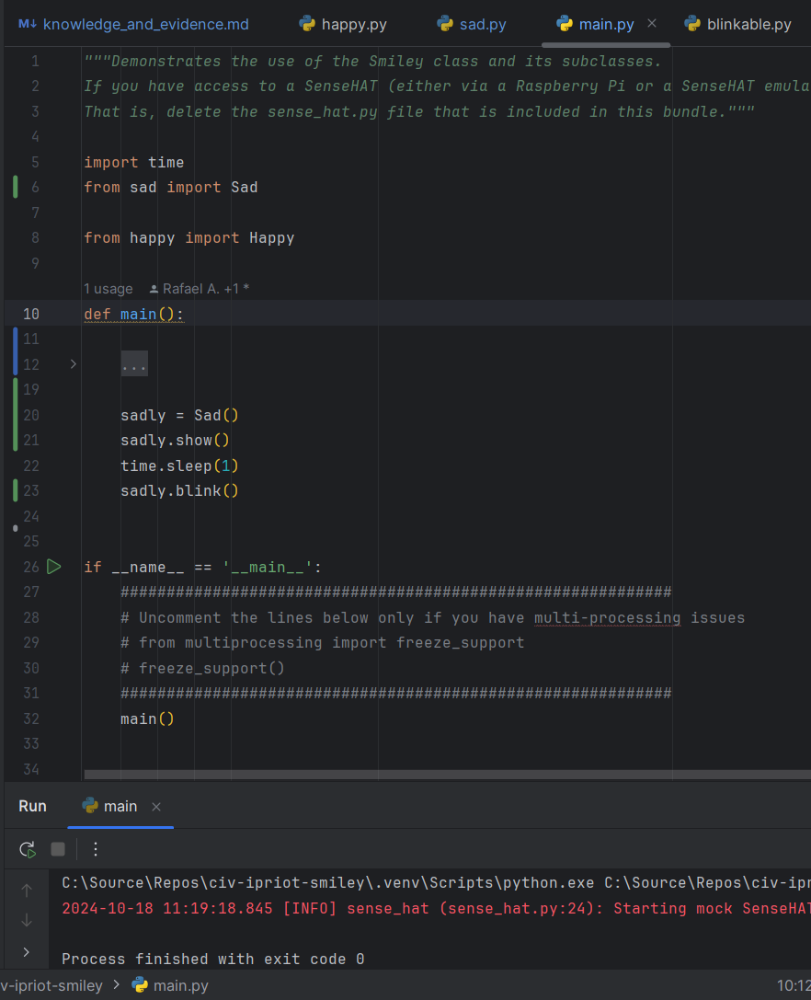
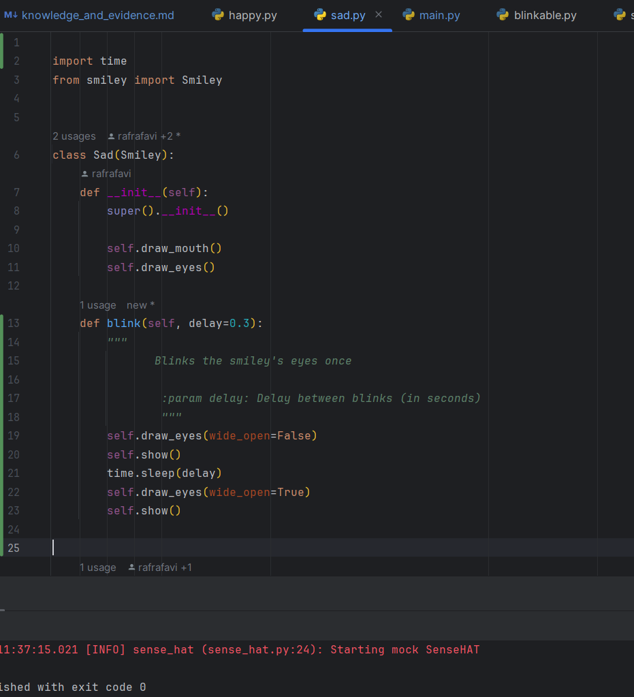
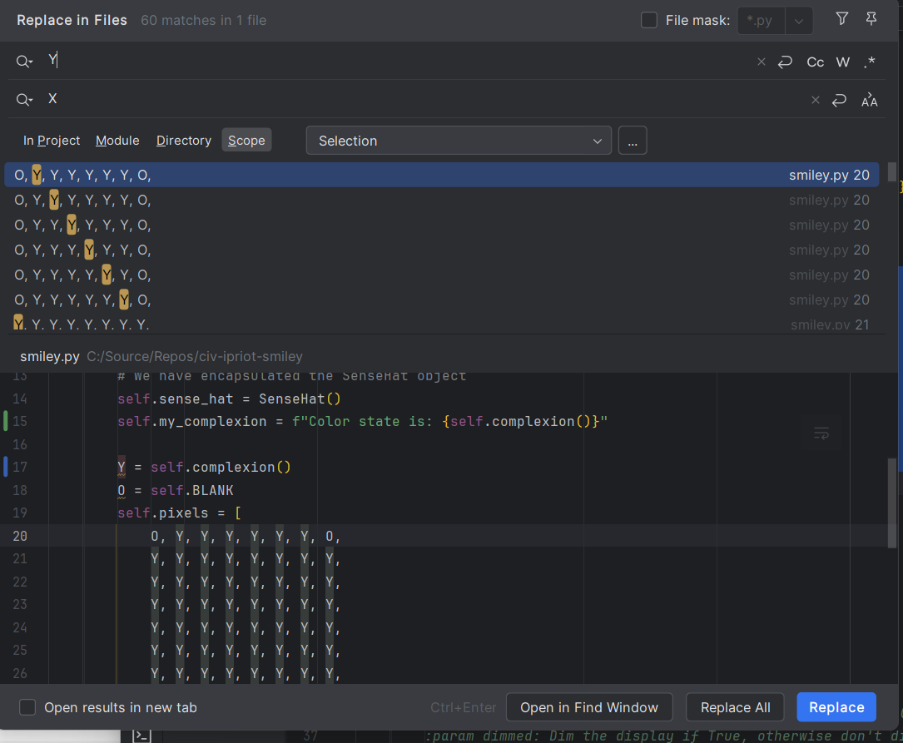

<style>

body {
    counter-reset: h2counter;
}

/* H1 - No numbering */
h1 {
    /* No counter reset or increment */
}

/* H2 - Level 1 numbering */
h2 {
    counter-reset: h3counter;
}

h2::before {
    counter-increment: h2counter;
    content: counter(h2counter) ". ";
}

/* H3 - Level 2 numbering */
h3 {
    counter-reset: h4counter;
}

h3::before {
    counter-increment: h3counter;
    content: counter(h2counter) "." counter(h3counter) " ";
}

/* H4 - Level 3 numbering (optional) */
h4 {
    counter-reset: h5counter;
}

h4::before {
    counter-increment: h4counter;
    content: counter(h2counter) "." counter(h3counter) "." counter(h4counter) " ";
}

</style>

# Evidence and Knowledge

This document includes instructions and knowledge questions that must be completed to receive a *Competent* grade on this portfolio task.

## Required evidence

### Answer all questions in this document

- Each answer should be complete, well-articulated, and within the specified word count limits (if added) for each question.
- Please make sure **all** external sources are properly cited.
- You must **use your own words**. Please include your full chat transcripts if you use generative AI in any way.
- Generative AI hallucinates, is not an authoritative source

### Make all the required modifications to the code

- Please follow the instructions in this document to make the changes needed to the code.

- When requested to upload evidence, upload all screenshots to `screenshots/` and embed them in this document. For example:

```markdown

```

- You must upload the code into your GitHub repository.
- While you can use a branch, your code should be in main when you submit.
- Upload a zip of this repository to Blackboard when you are ready to submit.
- You will be notified of your result via Blackboard
- However, if using GitHub classrooms, you may also receive additional feedback on GitHub directly

### Optional: Use of Raspberry Pi and SenseHat

Raspberry Pi or SenseHat is **optional** for this activity. You can use the included `sense_hat.py` file to simulate the SenseHat on your computer.

If you use a Pi, please **delete** the `sense_hat.py` file.

### Accessible version of the code

This project relies on visual patterns that appear on an LED matrix. If you have any accessibility requirements, you can use the `udl/accessible` branch to complete the project. This branch provides an accessible code version that uses text-based patterns instead of visual ones.

Please discuss this with your lecturer before using that branch.

## Specific Tasks & Questions

Address the following tasks and questions based on the code provided in this repository.

### Set up the project locally

1. Fork this repository (if not using GitHub Classrooms)
2. Clone your repository locally
3. Run the project locally by executing the `main.py` file
4. Evidence this by providing screenshots of the project directory structure and the output of the `main.py` file


If you are running on a Raspberry Pi, you can use the following command to run the project and then screenshot the result:

```bash
ls
python3 main.py
```

### Fundamental code comprehension

 Answer each of the following questions **as they relate to that code** supplied by in this repository (ignore `sense_hat.py`):

1. Examine the code for the `smiley.py` file and provide  an example of a variable of each of the following types and their corresponding values (`_` should be replaced with the appropriate values):

   | Type                    | name             | value                                                                |
   | ----------              |------------------|----------------------------------------------------------------------|
   | built-in primitive type | Boolean (dimmed) | True                                                                 |
   | built-in composite type | Tuple (WHITE)    | (255, 255, 255)                                                      |
   | user-defined type       | Class (Smiley)   | Encapsulation of Sense HAT,<br/>Predefined smiley design,<br/>Methods |

2. Fill in (`_`) the following table based on the code in `smiley.py`:

   | Object                   | Type |
   | ------------             |------|
   | self.pixels              | List |
   | A member of self.pixels  | Tuple |
   | self                     | Parameter     |

3. Examine the code for `smiley.py`, `sad.py`, and `happy.py`. Give an example of each of the following control structures using an example from **each** of these files. Include the first line and the line range:

   | Control Flow | File   | First line | Line range   |
   | ------------ |--------| ------- |--------------|
   |  sequence    | sad.py | mouth = [49, 54, 42, 43, 44, 45]| line 31      |
   |  selection   | sad.py | if wide_open: | line 42 - 45 |
   |  iteration   | sad.py | for pixel in mouth: | line 32 - 33 |

4. Though everything in Python is an object, it is sometimes said to have four "primitive" types. Examining the three files `smiley.py`, `sad.py`, and `happy.py`, identify which of the following types are used in any of these files, and give an example of each (use an example from the code, if applicable, otherwise provide an example of your own):

   | Type                    | Used? | Example          |
   | ----------------------- |-------|------------------|
   | int                     | Yes   | pixel = 10       |
   | float                   | Yes   | delay = 0.25     |
   | str                     | No    | greet = "Hello"  |
   | bool                    | Yes   | wide_open = True |

5. Examining `smiley.py`, provide an example of a class variable and an instance variable (attribute). Explain **why** one is defined as a class variable and the other as an instance variable.

> Class variable is "WHITE = (255, 255, 255)", and instance variable is "dimmed" in smiley.py.
> Class variables have the same value for all instances, while instance variables have a 
> different value for each instance. 
> 
> Class variableはすべてのインスタンスが同じ値を持ち、instance variableはインスタンスごとに値が変わる。

6. Examine `happy.py`, and identify the constructor (initializer) for the `Happy` class:
   1. What is the purpose of a constructor (in general) and this one (in particular)?

   > Happy class's constructor is : def __init__(self):
   > a general purpose : constructor is to initialize data when an object is created.
   > a particular purpose : to add two methods (draw_mouth(),draw_eyes())
   

   2. What statement(s) does it execute (consider the `super` call), and what is the result?

   > The Happy class is a child class of Smiley and Blinkable, so it inherits the attributes and methods of Happy and Blinkable in super().
   > 
   >HappyクラスはSmileyとBlinkableの子クラスなので、super()でHappyとBlinkableの属性とメゾットを継承します。 

### Code style

1. What code style is used in the code? Is it likely to be the same as the code style used in the SenseHat? Give to reasons as to why/why not:
   
> The official Python style guide, PEP8, is used. 
>The Sense HAT code focuses more on performance and user documentation and less on verbose documentation.
>
>Pythonの公式スタイルガイドであるPEP8が使われています。
>Sense HATのコードではパフォーマンスとユーザードキュメンテーションに重点をおいているので、詳細な記録にはあまり重点をおいていない。
>

2. List three aspects of this convention you see applied in the code.

> Indentation: Using 4 spaces per indentation level.
> Import: imports are written on separate lines.
> Blank Lines: Function and class definitions are separated by two blank lines.
>

3. Give two examples of organizational documentation in the code.

> [ EX1 in happy.py ] 
> """
   Provides a Smiley with a happy expression
    """
> Describes the parent class and class status.
> 親クラスとクラスの状態について説明している。
> 
>  [ EX2 in happy.py ] 
>"""
       Draws the eyes (open or closed) on the standard smiley.
        :param wide_open (bool): eyes open or closed.
        """
> The movement and parameters of the method and the parameters are explained.
> メゾット内の動きについてとバラメーターについての説明

### Identifying and understanding classes

> Note: Ignore the `sense_hat.py` file when answering the questions below

1. List all the classes you identified in the project. Indicate which classes are base classes and which are subclasses. For subclasses, identify all direct base classes.
  
  Use the following table for your answers:

| Class Name | Super or Sub? | Direct parent(s)  |
|------------|---------------|-------------------|
| NotReal    | Sub           | NotRealParent     |
| Happy      | Sub           | Smiley, Blinkable |
| Sad        | Sub           | Smiley            |
| Smiley     | Super         | No                |
| Blinkable  | Super         | ABC               |


2. Explain the concept of abstraction, giving an example from the project (note "implementing an ABC" is **not** in itself an example of abstraction). (Max 150 words)

> Abstraction is the inheritance of abstract attributes and methods as blueprints to other classes.
> 
>In this project, this is the blink method of the Blinkable class, which is inherited by the 
> Happy class and is given concrete movements within the Happy class.
> 
> Abstractionとは、抽象的な属性やメソッドを設計図として他のクラスへ継承すること。
> このプロジェクトでは、Blinkableクラスのblinkメゾットがそれにあたります。Happyクラスに継承されてHappyクラス内で具体的な動きが付けられます。


3. What is the name of the process of deriving from base classes? What is its purpose in this project? (Max 150 words)

> Inheritance
> 
> Creating child classes from an abstract class allows inheritance of the same attributes and methods, which reduces code duplication, increases readability and makes it easier to modify the code.
>
>抽象的なクラスから子クラスを作成することで同じ属性やメゾットを継承することができるので、コードの重複が少なくなり可読性が上がりコードの修正もし易くなる。


### Compare and contrast classes

Compare and contrast the classes Happy and Sad.

1. What is the key difference between the two classes?
   > Happy has Smiley and Blinkable as its parent classes, while Sad has only Smiley as its parent class.
   > 
   > HappyはSmileyとBlinkableが親クラスであり、SadはSmileyだけが親クラスである。
   >
2. What are the key similarities?
   > Both classes are parented by Smiley and have draw_eyes and draw_mouth methods.
   > 
   > どちらのクラスもSmileyが親クラスで、draw_eyes,draw_mouthメゾットを持っています。
   
3. What difference stands out the most to you and why?
   > The biggest difference is that the Happy class has a Blink method, so it is moving dynamically, whereas Sad does not inherit the blink method, so it is static with no movement.
   > 
   > 一番の違いはHappyクラスにはBlinkメソッドがあるので動的な動きがあるのに対し、Sadはblinkメソッドを受け継いでないので動きがなく静的である。
   
4. How does this difference affect the functionality of these classes
   > The Happy class inherits the blink method from Blinkable, which increases code flexibility and reusability. 
   > On the other hand, the Sad class does not have Blinkable as a parent class, which limits its movement and scope of use.
   > 
   >HappyクラスがBlinkableからblinkメソッドを継承することにより、柔軟性や再利用性が高まる。
   >一方で、SadクラスはBlinkableを親クラスに持たないので、動きや使用範囲に制限があります。

### Where is the Sense(Hat) in the code?

1. Which class(es) utilize the functionality of the SenseHat?
   > Smiley class and all child classes with Smiley class as parent class use SenseHat functionality.
   >
2. Which of these classes directly interact with the SenseHat functionalities?
   > Smiley class is directly interacted.
   >
3. Discuss the hiding of the SenseHAT in terms of encapsulation (100-200 Words)
   > Encapsulation combines data and the methods that manipulate that data into a single unit, such as a class. 
   > It can also limit direct access to the components of an object, thus preventing unintended interference and abuse. In the SenseHat class, pixel configuration, low-proof mode processing and GUI refresh are hidden from the user. 
   > Encapsulation also means that there is no need to understand how queue management and execution of separate processes work. 
   > Instead of understanding these details, they look at the method names in the SenseHat to see what they are doing. 
   > Encapsulation in this way abstracts away the complexity of the system, makes classes easier to use and manage, and protects internal state from inappropriate access or modification.
   > 
   >カプセル化はデータとそのデータを操作するメソッドをクラスなどで一つにまとめることである。また、オブジェクトの構成要素への直接アクセスを制限できるので、意図しない干渉や悪用を防ぐことが可能です。
   > SenseHatクラスではピクセルの設定、低証明モード処理、GUIのリフレッシュがユーザーからは隠されている。
   > また、カプセル化することでキューの管理や別プロセスの実行がどのように動いているかを理解する必要がない。
   > 詳細を理解する代わりに、SenseHat内のメソッド名をみてどんな動きをしているか確認する。
   > このようにカプセル化することによってシステムの複雑さが抽象化されてクラスが使いやすく管理しやすくなり、内部状態を不適切なアクセスや変更から保護することが出来ます。
   > 
   

### Sad Smileys Can’t Blink (Or Can They?)

Unlike the `Happy` smiley, the current implementation of the `Sad` smiley does not possess the ability to blink. Let's first explore how blinking has been implemented in the Happy Smiley by examining the blink() method, which takes one argument that determines the duration of the blink.

**Understanding Blink Mechanism:**

1. Does the code's author believe that every `Smiley` should be able to blink? Explain.

> Not all Smiley classes are blinkable. To add blink functionality, we need to have a 
> Blinkable class as a parent class.
> 
> すべてのSmileyクラスが瞬き出来るとはかぎりません。瞬きの機能をつけるにはBlinkableクラスを親クラスに持つ必要があります。
>

2. For those smileys that blink, does the author expect them to blink in the same way? Explain.

> All blink functions can differ from one class to another. 
> The blink in the Blinkable class is an abstract method, so concrete movements are added in inherited child classes.
> 
> すべての瞬き機能はそれそれのクラスによって違います。
>Blinkableクラスのblinkは抽象的メゾットなので、継承した子クラスで具体的な動きを追加します。

3. Referring to the implementation of blink in the Happy and Sad Smiley classes, give a brief explanation of what polymorphism is.

> Polymorphism means many forms, and we can have attributes and executable methods with the 
> same name for an object or class.
>  The Happy and Sad Smiley classes both have Smiley class attributes and methods, and also have different methods with the same name.
> 
>polymorphismとは多くの形という意味であり、オブジェクトやクラスに対して同じ名前の属性や実行可能なメゾットを持つことができます。
> Happy and Sad Smiley classesはどちらもSmileyクラスの属性とメゾットをもち、同じ名前で違う動きをします。

4. How is inheritance used in the blink method, and why is it important for polymorphism?

> It is guaranteed that child classes that inherit from the abstract class Blinkable will inherit the blink method.
> For polymorphism, different objects can be treated as Blinkable instances, even if the internal behaviour of the blink method is different. 
> Polymorphism also allows writing flexible and extensible code as long as it inherits from the Blinkale class.
>
>抽象クラスのBlinkableを継承する子クラスがblinkメソッドを継承することを保証している。
>ポリモーフィズムにとって異なるオブジェクトでblinkメソッドの内容が違っていても一律でBlinkableインスタンスとして扱うことが出来る。
> また、ポリモーフィズムを使用することでBlinkaleクラスを継承していれば柔軟で拡張可能なコードを書くことができます。
> 
1. **Implement Blink in Sad Class:**

   - Create a new method called `blink` within the Sad class. Ensure you use the same method signature as in the Happy class:

   ```python
   def blink(self, delay=0.25):
       pass  # Replace 'pass' with your implementation
   ```

2. **Code Implementation:** Implement the code that allows the Sad smiley to blink. Use the implementation from the Happy Smiley as a reference. Ensure your new method functions similarly by controlling the blink duration through the `delay` argument.

3. **Testing the Implementation:**

- Test the new blink functionality on your Raspberry Pi or within the Python classes provided. You might need to adjust the `main.py` script to incorporate Sad Smiley's new blinking capability.

Include a screenshot of the sad smiley or the modified `main.py`:




- Observe and document the Sad smiley as it blinks its eyes. Describe any adjustments or issues encountered during implementation.

  >Imported time and Blinkable into the Sad class and imported the Sad class into main.py.
  > Added blink method and gave movement to Sad class.
  > An object of the Sad class was created in main.py and a method assigned to it.
  > 
  > main.pyにSadクラスをimportした。
  > Sadクラスにblinkメソッドを追加し、動きを付与した。
  > main.pyにSadクラスのオブジェクトを作成してメソッドを指定した。

  ### If It Walks Like a Duck…

  Previously, you implemented the blink functionality for the Sad smiley without utilizing the class `Blinkable`. Assuming you did not use `Blinkable` (even if you actually did), consider how the Sad smiley could blink similarly to the Happy smiley without this specific class.

  1. **Class Type Analysis:** What kind of class is `Blinkable`? Inspect its superclass for clues about its classification.

     > Blinkable clas is an abstract class because it is inherited from ABC class.
     > 
     > BlinkableクラスはABCクラスを継承しているので抽象クラスです。

  2. **Class Implementation:** `Blinkable` is a class intended to be implemented by other classes. What generic term describes this kind of class, which is designed for implementation by others? **Clue**: Notice the lack of any concrete implementation and the naming convention.

  > Abstraction class

  3. **OO Principle Identification:** Regarding your answer to question (2), which Object-Oriented (OO) principle does this represent? Choose from the following and justify your answer in 1-2 sentences: Abstraction, Polymorphism, Inheritance, Encapsulation.

  > Binkable class represents abstraction of the object class, as the blink method is designed to allow child classes to implement its content. 
  > It also represents polymorphism, as different child classes have different internal behaviour.
  > 
  > Binkableクラスはblinkメソッドを子クラスに中身を実装してもらうようにできているので、オブジェクトクラスのAbstraction
  > と子クラスによって内部動作がことなるのでポリモーフィズムも表しています。
  > 

  4. **Implementation Flexibility:** Explain why you could grant the Sad Smiley a blinking feature similar to the Happy Smiley's implementation, even without directly using `Blinkable`.

  > Blink method of the Blinkable class has no internal operation assigned to it, so its behaviour is not determined simply by inheriting from it. 
  > Therefore, by implementing the internal operations of the blink method in the Sad class 
  > in the same way as in the Happy class, a blinking function can be implemented without directly using Blinkable.
  > 
  > Blinkableクラスのblinkメソッドには内部動作が付与されていないため、継承しただけでは動作は決められていません。
  > なので、Sadクラスにblinkメソッドの内部操作まで実装することでBlinkableを直接使わなくても点滅機能が実装出来ます。

  5. **Concept and Language Specificity:** In relation to your response to question (4), what is this capability known as, and why is it feasible in Python and many other dynamically typed languages but not in most statically typed programming languages like C#? **Clue** This concept is hinted at in the title of this section.

  >It is known as Duck Typing. Dynamic languages such as Python allow for flexible expressions as they are determined by methods and attributes rather than specific types. 
  > Static languages such as C# require explicit type declarations and are strictly checked 
  > at compile-time, which limits flexibility but increases type safety.
  > 
  > それはDuck Typingとして知られています。
  > Pythonのような動的な言語では特定の型ではなく、メソッドや属性によって判断されるので柔軟な表現が可能になる。
  > C#のような静的な言語では明示的な型宣言が必要であり、コンパイル時に厳しくチェックされるため柔軟性は制限されるが型の安全性は高くなる。

  ***

  ## Refactoring

  ### Does a Smiley Have to Be Yellow?

  While our current implementation predominantly features yellow smileys, emotional expressions like sickness or anger typically utilize colors like green, red, or orange. We'll explore the feasibility of integrating these colors into our smileys.

  1. **Defined Colors and Their Location:**

     1. Which colors are defined and in which class(s)?
        > Green is defined in sick class. Red is defined in for anger class. Orange is defined in happy class. Blue is defined in sad class.
     2. What type of variables hold these colors? Are the values expected to change during the program's execution? Explain your answer.
        > Using Tuple, as the colour number of each colour does not change. The colour does not change while one emotion is running.
        > 
        > それぞれの色の色番号は変わらないので、Tupleを使用します。 一つの感情を実行している間は色は変わりません。 
     3. Add the color blue to the appropriate class using the appropriate format and values.

  2. **Usage of Color Variables:**

     1. In which classes are the color variables used?
        > Happy, Sad

  3. **Simple Method to Change Colors:**
  4. What is the easiest way you can think to change the smileys to green? Easiest, not necessarily the best!
     > Rewritting the YELLOW value in smiley.py with a GREEN value.
     > 
     > smiley.pyのYELLOWの値を緑色の値に書き換える。 

  Here's a revised version of the "Flexible Colors – Step 1" section for the smiley project, incorporating your specifications for formatting and content updates:

  ### Flexible Colors – Step 1

  Changing the color of the smileys once is straightforward, but it isn't very flexible. To facilitate various colors for smileys, it is advisable not to hardcode values in any class. This approach was identified earlier as a necessary change. Let's start by removing the built-in assumptions about color in our classes.

  1. **Add a method called `complexion` to the `Smiley` class:** Implement this instance method to return `self.YELLOW`. Using the term "complexion" instead of "color" provides a more abstract terminology that focuses on the meaning rather than implementation.

  2. **Refactor subclasses to use the `complexion` method:** Modify any subclass that directly accesses the color variable to instead utilize the new `complexion` method. This ensures that color handling is centralized and can be easily modified in the future.

  3. **Determine the applicable Object-Oriented principle:** Consider whether Abstraction, Polymorphism, Inheritance, or Encapsulation best applies to the modifications made in this step.

  4. **Verify the implementation:** Ensure that the modifications function as expected. The smileys should still display in yellow, confirming that the new method correctly replaces the direct color references.

  This step is crucial for setting up a more flexible system for color management in the smiley display logic, allowing for easy adjustments and extensions in the future.

  ### Flexible Colors – Step 2

  Having removed the hardcoded color values, we now enhance the base class to support dynamic color assignments more effectively.

  1. **Modify the `__init__()` method in the `Smiley` class:** Introduce a default argument named `complexion` and assign `YELLOW` as its default value. This allows the instantiation of smileys with customizable colors.

  2. **Introduce a new instance variable:** Create a variable called `my_complexion` and assign the `complexion` parameter to it. This step ensures that each smiley instance can maintain its own color state.

  3. **Rationale for `my_complexion`:** Using a distinct instance variable like `my_complexion` avoids potential conflicts with the method parameter names and clarifies that it is an attribute specific to the object.

  4. **Bulk rename:** We want to update our grid to use the value of complexion, but we have so many `Y`'s in the grid. Use your IDE's refactoring tool to rename all instances of the **symbol** `Y` to `X`. Where `X` is the value of the `complexion` variable. Include a screenshot evidencing you have found the correct refactor tool and the changes made.

  


  5. **Update the `complexion` method:** Adjust this method to return `self.my_complexion`, ensuring that whatever color is assigned during instantiation is what the smiley displays.

  6. **Verification:** Run the updated code to confirm that Smileys still defaults to yellow unless specified otherwise.

  ### Flexible Colors – Step 3

  With the foundational changes in place, it's now possible to implement varied smiley colors for different emotional expressions.

  1. **Adjust the `Sad` class initialization:** In the `Sad` class's initializer method, change the superclass call to include the `complexion` argument with the value `self.BLUE`, as shown:

     ```python
     super().__init__(complexion= self.BLUE)
     ```

  2. **Test color functionality for the Sad smiley:** Execute the program to verify that the Sad smiley now appears blue.

  3. **Ensure the Happy smiley remains yellow:** Confirm that changes to the Sad smiley do not affect the default color of the Happy smiley, which should still display in yellow.

  4. **Design and Implement An Angry Smiley:** Create an Angry smiley class that inherits from the `Smiley` class. Set the color of the Angry smiley to red by passing `self.RED` as the `complexion` argument in the superclass call.

  ***

> References 
> “Constructors in Python.” GeeksforGeeks, 7 Nov. 2018, www.geeksforgeeks.org/constructors-in-python/.
> “Object Oriented Programming in Pyth: Class and Instance Variables.” DigitalOcean, www.digitalocean.com/community/tutorials/understanding-class-and-instance-variables-in-python-3.
> “PEP 8: The Style Guide for Python Code.” Pep8.org, pep8.org/.“PyCharm Help.” PyCharm Help, 2024, www.jetbrains.com/help/pycharm/finding-and-replacing-text-in-project.html#replace_search_string_in_project. Accessed 21 Oct. 2024.
> “Understanding Abstraction in Python: Simplifying Complex Concepts.” Analytics Vidhya, 28 Feb. 2024, www.analyticsvidhya.com/blog/2024/02/understanding-abstraction-in-python-simplifying-complex-concepts/.
